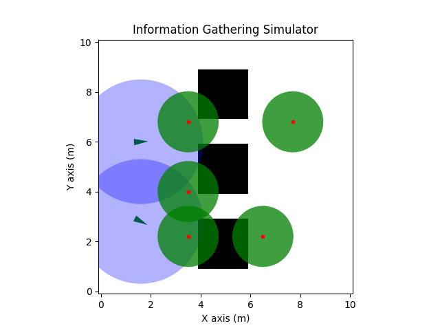

# Information Gathering Library

This repository provides an API for setting up and running multi-robot active information gathering experiments, using a variety of robot dynamics, sensor combinations and environments. The code is implemented in C++, and the API can be used in either C++ or with Python via bindings generated with PyBind11, for rapid prototyping and convenience. Examples are included. 

This respository accompanies the 2018 RAL paper: http://ieeexplore.ieee.org/document/8260881/. 

To use this package with ROS, see this repository:

## Dependencies
### Operating System 
The library can be used in both Linux and Mac environments, but has been primarily tested with Ubuntu (18.04).

Ensure that the following dependencies are installed using either `apt-get` or `brew`:

- Boost
- Eigen3
- Yaml-CPP
- Pybind11
- CGAL
- pkg-config

## Compilation
To compile the library:

    cd <install_location>
    mkdir build && cd build
    cmake .. 
    make -j 4

To build the tests and Python bindings, change the cmake command to:
	
	cmake .. -DBUILD_TESTS=ON -DPYTHON_BINDINGS=ON

If you have a newer version of YAML or are running on a Mac, pass this option to CMake:

    cmake .. -DOLD_YAML=OFF 

To run the tests, run the following command:
	
	make test

## Configuring an Experiment
Experiments scenarios are configured by scenario files written in YAML. See data/init_info_planner_ARVI.yaml for a working example. 

## Example Usage in C++

Experiments can be run using C++ or Python. In C++, the configuration for the robot starting locations, sensing model, and other parameters is done in data/init_info_planner_ARVI.yaml. 

The sample experiment can be executed:

    bin/test_info_planner_ARVI data/init_info_planner_ARVI.yaml

## Usage in Python

The simulation can be configured in Python directly as in `pyInfo.py` or with the same YAML files as the C++ version as in `pyInfoYaml.py`.

To visualize a simulation, run the following script:

    python3 script/python/pyInfo.py --display 1
    

## Immediate To-Do's
- Clean up State Space / ENV representation to allow for motion primitives on SE(3), and define distance metrics 
on the Pose types themselves, for cleaner usage in RVI / ARVI delta-crossing.
- Clean up the way that Coordinate Descent Planning is implemented, e.g. by wrapping
the ARVI Planner into a new Planner that takes in a team of Robots, rather than the user having to manage
the Coordinate Descent algorithm themselves.

# Future Features to be supported
- Robots and targets are both general 'Agents', which can have a full state space in SE(3). Robots can hold a belief (target) model, for any agents whose pose they wish to estimate (including itself). This model can be converted by the planner into a Linear Gaussian model, and used for target tracking.
- The above means each state Space must be convertible to SE(3), and vice versa. Either SE(3) should be the baseline, and we project down into lower spaces for control, or the other spaces exist and we lift into SE(3) for generic operations on the robot state. I vote for making everything SE(3) and projecting into lower spaces for control.
- Come up with a good interface for what an Agent is, and what traits it posesses. I.e. robot has a state Space (SE(3)), an action space (on some subspace of SE(3)), one or more sensors, a planner, which generates a trajectory, and a controller to follow the trajectory. 
- We should include drivers for the sensors in the Sensor package, which interface between hardware and the Sensor models we have, i.e. Gazebo / real LIDAR or camera into our camera or range and bearing sensors.
- A ROS wrapper which can allow us to wrap robot topics and sensors from Gazebo into the appropriate pieces of our module. (DONE)
- Software should be modular and split into packages that are easy to pull in, and maintained in a repository. I.e. Estimation, planning, Base (robots and state spaces perhaps).
